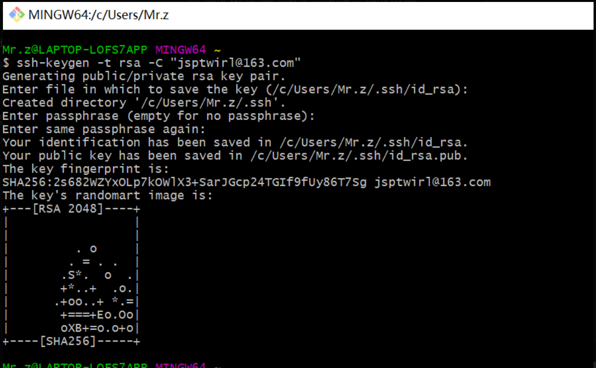

# 在Windows上配置Git

第一步：设置用户名和邮箱，命令如下：
$ git config --global user.name "Your Name"
$ git config --global user.email "email@example.com"

因为Git是分布式版本控制系统，所以，每个机器都必须自报家门：你的名字和Email地址。你也许会担心，如果有人故意冒充别人怎么办？这个不必担心，首先我们相信大家都是善良无知的群众，其次，真的有冒充的也是有办法可查的。

注意git config命令的--global参数，用了这个参数，表示你这台机器上所有的Git仓库都会使用这个配置，当然也可以对某个仓库指定不同的用户名和Email地址。

第二步：创建SSH Key
    在用户主目录下(C:\Users\Mr.z),看看有没有.ssh目录，如果有在看看目下是否有id_rsa和id_rsa.pub,如果有则跳过本步骤，没有，则Git Bash执行如下命令：
$ssh-keygen -t rsa -C "Youremail@example.com"  此处邮箱换成自己的邮箱
说明：id_rsa是私钥，不能泄露
    id_rsa.pub是公钥，可以告诉别人
