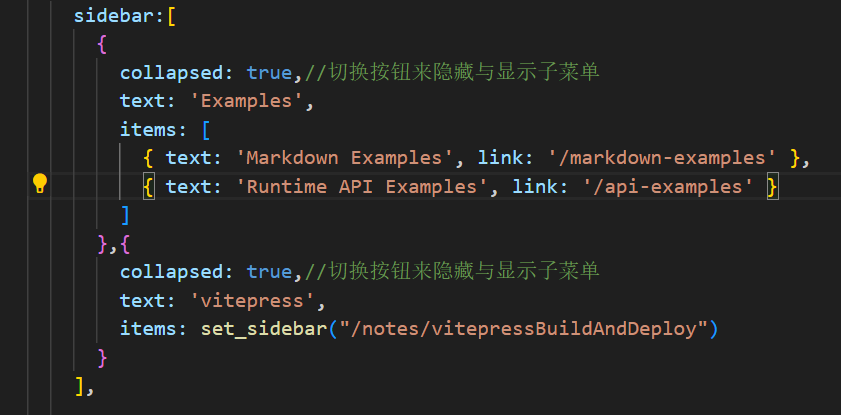

# vitepress搭建并部署网站

## 前置条件

* Node.js 18 及以上版本

## 安装项目

第一个问题：是否在当前根目录下创建vitepress项目，默认就好
第二个问题：站点标题；自己喜欢什么填写什么
第三个问题：站点描述；
第四个问题：主题；我这里默认是用了第二个，第一个和第三个主题不知道是啥了，没试过。
第五个问题：是否使用TypeScript来配置和主题文件；这里可以否
第六个问题：是否将vitepress npm添加到package.json中？这里选是
成功初始化之后，正常目录如下：

使用vscode打开文件夹之后，在终端中执行如下命令：`npm run docs:dev`，结果如下：

复制地址，然后在浏览器中打开地址，表示成功创建：


## 自定义配置

### 美化首页


* 修改位置
  * ②-⑥：index.md
  * ①、⑦、⑧：config.mjs
  
* 具体位置：
    页面中间部分
  * index.md文件
        name<---->②  name 是文档标题
        text====>③  text 是类似于文档副标题
        tagline====>④ tagline 是文档标语
        actions====>⑤ 就是那两颗按钮
        features====>⑥ 下面的特性按钮

    
    页面头部与脚本
  * config.mjs文件
        title====>① 标题
        nav====>⑦ 导航
        socialLinks====>⑧ GitHub图标链接
        footer====>⑨ 需要自行添加代码
    
说明：Hero部分:部分位于主页顶部

背景图与logo图标
    首先在根目录下新增一个public文件夹，将我们的需要的图片放到文件中
    背景图：
        在index.md文件中Hero下添加image,如下图所示：
        
    logo图标:
        在config.mjs文件中,themeConfig层中添加logo脚本，如下图所示：
        
    本地搜索：
        在config.mjs文件中,themeConfig层中添加seach脚本，代码如下：

```js
search: {    //本地搜索
    provider: 'local',
    options:{
        translations: {
        button:{
            buttonText:"搜索文档",
            buttonAriaLabel:"搜索文档"
        },
        modal:{
            noResultsText:"未找到相关结果",
            resetButtonTitle:"清除查询条件",
            footer:{
            selectText:"选择",
            navigateText:"切换"
            }
        }
        }
    }
}

```

### 美化文章页

* 官方默认是左中右三边栏
* 左边是sidebar配置
* 中间是文章内容
* 右边是显示的文章目录（默认显示一二级）

#### 左侧导航栏

##### 关闭左侧边栏

在config.mjs中的themeConfig配置对象中配置，添加如下代码`sidebar: false, // 关闭左侧边栏`

##### 左侧边栏配置

&emsp;&emsp;sidebar是数组。修改路径是：defineConfig->themeConfig->sidebar配置，如图：

效果如下：


##### 子目录折叠

&emsp;&emsp;在config.mjs文件中defineConfig->themeConfig->sidebar的对象中，添加 collapsed属性。默认情况下，所有部分都是“打开”的。如果希望它们在初始页面加载时“关闭”，请将 collapsed 选项设置为 true。如下面代码所示：


#### 右侧导航栏

##### 关闭右侧边栏

&emsp;&emsp;在config.mjs中的themeConfig配置对象中配置，添加如下代码

```aside: false, // 关闭右侧边栏```

##### 左侧显示

&emsp;&emsp;在config.mjs中的themeConfig配置对象中配置，添加如下代码

```aside: "left", // 设置右侧侧边栏在左侧显示```

##### 右侧大纲配置

&emsp;&emsp;右侧导航栏默认索引的是md文件的一二级标题，可能需要定义索引的标题级别和On this page这个说明。这个时候需要在config.mjs中配置下面这两个选项，outlineTitle用于替代On this page。outline定义展示的标题级别，这里定义2-6级

#### 扩展

##### 自动生成左侧边栏

&emsp;&emsp;我们使用这种配置时常常是一个目录有很多md文件，这些md文件所在的目录对应导航栏的一个选项。侧边栏的配置需要自己手写一个个路由映射到相应的文件上，那么有没有一个自动生成侧边栏的工具呢？下面这个脚本,就是根据一个目录下面的所有md文件自动生成路由。

* **第一步：** 根目录下新增一个文件夹utils,并创建auto-gen-sidebar.mjs文件，将如下脚本复制进去

```js
import path from "node:path";
import fs from "node:fs";

// 文件根目录
const DIR_PATH = path.resolve();
// 白名单,过滤不是文章的文件和文件夹
const WHITE_LIST = [
  "index.md",
  ".vitepress",
  "node_modules",
  ".idea",
  "assets",
];

// 判断是否是文件夹
const isDirectory = (path) => fs.lstatSync(path).isDirectory();

// 取差值
const intersections = (arr1, arr2) =>
  Array.from(new Set(arr1.filter((item) => !new Set(arr2).has(item))));

// 把方法导出直接使用
function getList(params, path1, pathname) {
  // 存放结果
  const res = [];
  // 开始遍历params
  for (let file in params) {
    // 拼接目录
    const dir = path.join(path1, params[file]);
    // 判断是否是文件夹
    const isDir = isDirectory(dir);
    if (isDir) {
      // 如果是文件夹,读取之后作为下一次递归参数
      const files = fs.readdirSync(dir);
      res.push({
        text: params[file],
        collapsible: true,
        items: getList(files, dir, `${pathname}/${params[file]}`),
      });
    } else {
      // 获取名字
      const name = path.basename(params[file]);
      // 排除非 md 文件
      const suffix = path.extname(params[file]);
      if (suffix !== ".md") {
        continue;
      }
      res.push({
        text: name,
        link: `${pathname}/${name}`,
      });
    }
  }
  // 对name做一下处理，把后缀删除
  res.map((item) => {
    item.text = item.text.replace(/\.md$/, "");
  });
  return res;
}

export const set_sidebar = (pathname) => {
  // 获取pathname的路径
  const dirPath = path.join(DIR_PATH, pathname);
  // 读取pathname下的所有文件或者文件夹
  const files = fs.readdirSync(dirPath);
  // 过滤掉
  const items = intersections(files, WHITE_LIST);
  // getList 函数后面会讲到
  return getList(items, dirPath, pathname);
};
```

* **第二步：** 在comfing.mjs文件中，需要导入刚刚的工具脚本

```js
import { set_sidebar } from "../utils/auto-gen-sidebar.mjs";    // 改成自己的路径
```

* **第三步：** 修改config.mjs的sidebar,代入如下：

```js
sidebar:[
      {
        collapsed: true,//切换按钮来隐藏与显示子菜单
        text: 'Examples',
        items: [
          { text: 'Markdown Examples', link: '/markdown-examples' },
          { text: 'Runtime API Examples', link: '/api-examples' }
        ]
      },{
        collapsed: true,//切换按钮来隐藏与显示子菜单
        text: 'vitepress',
        items: set_sidebar("/notes/vitepressBuildAndDeploy")
      }
    ]
```

> **TODO：** sidebar是一个数组，items是一个数组，数组每个元素都需要有text,link，set_sider函数返回的是具有一个text、link元素对象的数组

### 美化地址栏icon

&emsp;&emsp;在config.mjs文件中defineConfig添加如下代码：

```js
  head: [["link", { rel: "icon", href: "/logo.png" }]],
```

如图所示：

效果如下：

